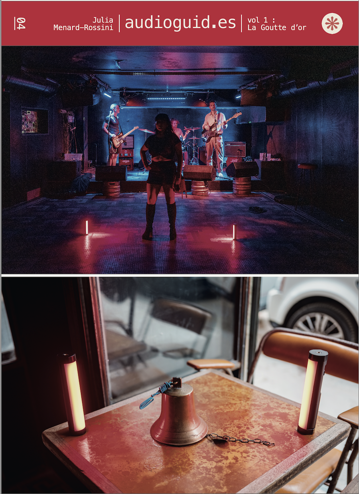

<a name="readme-top"></a>

<!-- PROJECT LOGO -->
<div align="center" >
  <a href="https://audioguid.es">
    
  </a>
</div>

<h3 align="center">audioguid.es</h3>

<p>audioguid.es est un ensemble d’objets photographiques s’intéressant à la fois à la mémoire des territoires et des habitants. </p>
<p>Entre le guide audio et la capsule temporelle, audioguid.es capture la mémoire, l’état d’esprit des personnes vivant ou travaillant dans le quartier de la Goutte d’Or à Paris pendant l’été 2022.  </p>


<!-- TABLE OF CONTENTS -->
<details>
  <summary>Table des matières</summary>
  <ol>
    <li>
      <ul>
        <li><a href="#built-with">À propos du projet </a></li>
      </ul>
    </li>
    <li>
      <a href="#getting-started">Pour commencer</a>
      <ul>
        <li><a href="#prerequisites">Conditions préalables</a></li>
        <li><a href="#installation">Installation</a></li>
      </ul>
    </li>
    <li><a href="#usage">Utilisation</a></li>
    <li><a href="#roadmap">Feuille de route</a></li>
    <li><a href="#contributing">Contribution</a></li>
    <li><a href="#license">License</a></li>
    <li><a href="#contact">Contact</a></li>
    <li><a href="#acknowledgments">Remerciements</a></li>
  </ol>
</details>


<!-- ABOUT THE PROJECT -->
## À propos du projet



<p align="right">(<a href="#readme-top">back to top</a>)</p>


<!-- GETTING STARTED -->
## Pour commencer

audioguid.es est un ensemble d’objets photographiques s’intéressant à la fois à la mémoire des territoires et des habitants. Entre le guide audio et la capsule temporelle, audioguid.es capture la mémoire, l’état d’esprit des personnes vivant ou travaillant dans le quartier de la Goutte d’Or à Paris pendant l’été 2022.
Les cassettes audios sont le moyen de transmission le plus simple de la musique dans les années 80/90 et souvent un lien personnel entre les individus et leur communauté.
De la goutte d’or cadastrale à la goutte d’or des métros, elle prend parfois une dimension plus importante : Zone d’accueil, de migration, de passage, de commerce, de travail, de deal, la Goutte d’Or possède une géographie propre à chaque communauté, à chaque personne.

Les 10 cassettes qui composent cet ensemble sont des enregistrements des entretiens et une sélection de musiques sur les faces A. Sur les faces B, un enregistrement DATA de la cassette permettant une transmission et une pérennité de l’œuvre.

## Données techniques :
-  10 cassettes noires audios ferro 90 minutes dans une mallette « TAPE TAXI » rouge
-  boitiers cassette deluxe fond rouge
-  tirages recto verso sur papier photo format J-CARD
-  face A : enregistrement audio (interview et sélection musicale)
-  face B : enregistrement data (audio modem tones)

## Conditions préalables pour écouter la partie face A (AUDIO)

Il existe deux moyens pour écouter la face A de chaque cassette.

- Cas 1: Vous avez accès à la mallette et aux cassettes : il suffit de mettre une cassette dans un lecteur audio et d'appuyer sur lecteur. La qualité de restitution dependra de votre installation.
- Cas 2: Vous n'avez pas accès à la mallette et aux cassettes : vous pouvez écouter les pistes sur une plateforme de streaming et sur audioguid.es

## Conditions préalables pour copier la partie face B (DATA) chez @meaningful

La mallette et les 10 cassettes seront présentées aux publics dans le studio de Meaningful. Il sera possible de copier la partie DATA sur un autre support.

- support USB : si vous avez une clé USB, il suffit de l'inserer dans le magnétophone mis à votre disposition et de lancer l'enregistrement. Chaque face de données a une durée différente mais il faudra attendre 45 minutes pour que la copie soit effective.

- copier audio via line : si vous avez un dispositif avec une entrée jack, il est possible de copier le son directement. Le format du fichier doit être en WAV

- copier audio via un microphone usb : Il est possible d'enregistrer le son via un microphone .

## Conditions préalables pour décoder la partie face B (DATA) chez @meaningful

Un micro-ordinateur sous Linux Debian est à votre disposition pour tester le décodage des pistes DATA des cassettes. Pour des raisons pratiques, les pistes DATA sont déja disponible. Il est en effet possible d'enregistrer la piste avec un micro ou un telephone mais le bruit ambiant et la longueur des pistes ne sont pas compatible avec le bruit ambiant.

Pour acceder aux pistes, il suffit de naviguer avec le clavier dans la console de l'ordinateur

Attention le clavier est en QWERTY


Pour le symbole |  il faut taper sur shift +  \ ( en dessous de la touche retour)

* navigation
  ```cd Desktop/vol1```

* voir la liste des pistes
  ```ls```

* choisir un dossier
  ```cd nomdelapiste```

* decoder le fichier wav
  ```minimodem -r 1200 -f nomdelacassette.wav --rx-one|tar -C ./ -xzvf -```

* voir le resultat
  ```ls```


## Conditions préalables pour décoder la partie face B (DATA) en récuperant la piste sur bandcamp

### Si vous utilisez un ordinateur sous mac os :

* installer brew.sh https://brew.sh
* ouvrir le terminal (Dossier Applications)
* installer minimodem
  ```brew install minimodem```
* Dans le terminal : ouvrir le dossier contenant le piste WAV
* decoder le fichier wav
  ```minimodem -r 1200 -f nomdelacassette.wav --rx-one|tar -C ./ -xzvf -```
* voir le resultat
  ```ls```

### Si vous utilisez un ordinateur sous linux  :

On va pas se mentir, vous etes à l'aise avec le sujet.

Il faut simplement installer minimodem sur votre distribution linux

* Ubuntu installation:

```sudo add-apt-repository ppa:kamalmostafa/minimodem```

```sudo apt-get update```

```sudo apt-get install minimodem```

* Debian installation:

```sudo apt-get install minimodem```

* Fedora installation:

```sudo yum install minimodem```

### Si vous utilisez un ordinateur sous windows  :

bonne lecture : https://fr.wikipedia.org/wiki/Windows_Subsystem_for_Linux

<p align="right">(<a href="#readme-top">back to top</a>)</p>


<


<!-- ROADMAP -->
## Feuille de route

- [ ] 15 septembre 2022: release vol.1
    - [x] présentation @meaningful
    - [x] mise en ligne du site audioguid.es
    - [x] mise en vente exemplaire #2 du site sur bandcamp https://audioguides.bandcamp.com
    - [x] mise en vente des pistes DATA du site sur bandcamp https://audioguides.bandcamp.com

- [ ] Novembre 2022: lancement du programme ./audioguides.sh

- [ ] hiver 2022 - 2023: préparation vol.2

- [ ] 2023 - 202X: disponible pour d'autres projets. N'hésitez pas à me contacter.


<p align="right">(<a href="#readme-top">back to top</a>)</p>


<!-- LICENSE -->
## License

All pictures, design, audio files are © Mathieu Drouet - 2022 / Agathe Vuachet

Photographie, conception, réalisation : Mathieu Drouet ( mathieu-drouet.com ) dans le cadre d'une résidence artistique pour le studio Meaningful ( meaningful.fr )
Direction artistique : Agathe Vuachet ( agathe.cool )
Mixage : Tenor Maestro
Post-production : Mathieu Drouet avec le soutien de crumplepop.com

<p align="right">(<a href="#readme-top">back to top</a>)</p>


<!-- CONTACT -->
## Contact

Mathieu - [@twitter_handle](https://twitter.com/izo) - mathieu@drouet.io

Project Link: [https://audioguid.es](https://audioguid.es)

<p align="right">(<a href="#readme-top">back to top</a>)</p>


<!-- ACKNOWLEDGMENTS -->
## Remerciements

Ce projet fut réalisé entre juin et septembre 2022 avec un appareil photo moyen format, deux lumières LED rouge, un enregistreur audio, 30 cassettes audios, un raspberry pi et des logiciels libres ( Debian, Minimodem, Spip )

Merci à tout les participants du projet ( Yann, Cebos, Cerise, Julia, Emmanuelle, Pascal, Jaurés, Hamid, Ariane, Fred), à toute l'équipe de Meaningful pour leur confiance, à Agathe pour ton soutien et ton talent

Ce projet n'aurait jamais vu le jour sans le soutien technique de :

- Crumplepop pour l'audio https://crumplepop.com
- Pierre Dadumont pour le fabuleux journal du lapin https://www.journaldulapin.com
- Kamal Mostafa pour la logiciel Minimodem http://www.whence.com/kamal/
- Robert Klebe pour les scripts https://www.dotpointer.ga/?section=notes&view=note&id_notes=87
- Olivier (DaffyDuke) Duquesne https://about.me/olivier.duquesne
- Mike Kohn pour les conseils https://www.mikekohn.net/

## Tracklisting


### Cassette 1: Yann
1. Yann
2. My Sister Klaus - Chateau Rouge
3. Papa Wemba & Hector Zazou - Malimba

### Cassette 2: Cebos
1. Cebos
2. Koma - Connexion
3. Koma - Loin des Rêves
### Cassette 3: Cerise
1. Cerise
2. Urfali Babi - Disko Kebap
### Cassette 4: Julia
1. Julia
2. Hotel Lux - English Disease
### Cassette 5: Emmanuelle
1. Emmanuelle
2. Hugo TSR - Là-Haut
3. Sopico - Domo feat. Nepal
### Cassette 6: Pascal
1. Pascal
2. Saisai - Censured 🔞
### Cassette 7: Jaurès
1. Jaurès
2. Hugo TSR - Jeune Du 18
3. Hamou CHEHEB - Samedi Midi Barbès
### Cassette 8: Hamid
1. Hamid
2. Cheb Hasni - Latebkiche hada mektoubi
### Cassette 9: Ariane
1. Ariane
2. 113 - Tonton Du Bled
### Cassette 10: Fred
1. Fred
2. Le Ton Mite - Space Needle


<p align="right">(<a href="#readme-top">back to top</a>)</p>
